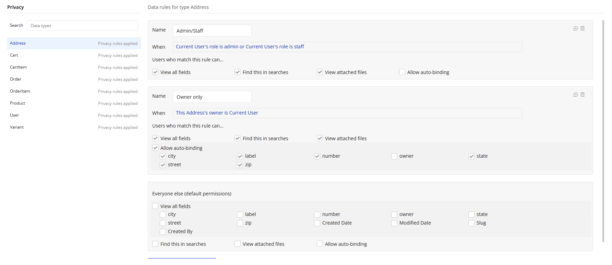

# Chair Store - Functional Architecture (Bubble)

------------------------------------------------------------------------

# 1. Project Overview

This project is a functional chair e-commerce built in Bubble.

The focus is architecture, security, and consistency --- not UI design.

The goal is to simulate a production-ready structure with:

-   Clean data modeling
-   Proper privacy rules
-   Safe order and stock handling
-   Organized workflows

------------------------------------------------------------------------

## Roles

-   guest
-   customer
-   admin
-   staff

------------------------------------------------------------------------

## V1 Scope

The first version includes:

-   Product catalog
-   Product detail with variants
-   Cart system
-   Checkout flow
-   Order creation
-   Basic admin panel
-   Stock control

------------------------------------------------------------------------

# 2. Option Sets

## UserRole

admin\
staff\
customer

## OrderStatus

pending_payment\
paid\
packing\
shipped\
delivered\
canceled\
refunded

## CouponType

percent\
fixed

------------------------------------------------------------------------

# 3. Data Model

## Product

Fields:

-   title (text)
-   slug (text, unique)
-   description (text)
-   images (list of image)
-   is_active (yes/no)
-   featured (yes/no)

Screenshot: 

------------------------------------------------------------------------

## Variant

Each product can have multiple variants (SKU-level).

Fields:

-   product (Product)
-   sku (text, unique)
-   name (text)
-   price (number)
-   compare_at_price (number)
-   stock_qty (number)
-   is_active (yes/no)

Screenshot: 

------------------------------------------------------------------------

## Cart

Fields:

-   owner (User)
-   items (list of CartItem)

Screenshot: 

------------------------------------------------------------------------

## CartItem

Fields:

-   cart (Cart)
-   variant (Variant)
-   qty (number)
-   unit_price_snapshot (number)

Screenshot: 

------------------------------------------------------------------------

## Address

Fields:

-   owner (User)
-   label (text)
-   zip (text)
-   street (text)
-   number (text)
-   city (text)
-   state (text)

Screenshot: 

------------------------------------------------------------------------

## User

Additional Fields:

-   role (UserRole)
-   name (text)
-   phone (text)
-   is_blocked (yes/no)
-   default_address (Address)

Screenshot: 

------------------------------------------------------------------------

## Order

Snapshot logic is used to preserve historical data.

Fields:

-   order_number (text)
-   customer (User)
-   status (OrderStatus)
-   items (list of OrderItem)
-   shipping_address_snapshot (text)
-   subtotal (number)
-   discount (number)
-   shipping (number)
-   total (number)
-   payment_provider (text)
-   payment_intent_id (text)
-   created_at (date)

Screenshot: 

------------------------------------------------------------------------

## OrderItem

Fields:

-   order (Order)
-   variant_snapshot (text)
-   unit_price_snapshot (number)
-   qty (number)
-   subtotal (number)

Screenshot: 

------------------------------------------------------------------------

# 4. Privacy Rules

Security rules implemented from the start.

General principle:

-   No sensitive data searchable by Everyone.
-   Users can only access their own data.
-   Admin/Staff have controlled elevated access.

  ### Default Permissions Policy

  For every Data Type, **"Everyone else (default permissions)" is always fully disabled**.

  No fields are exposed by default.

  Access is granted explicitly and only when strictly necessary, following the principle of least privilege.

  Rules are defined intentionally per role and per ownership condition, and permissions are opened incrementally based on real functional requirements.

Screenshot: 

------------------------------------------------------------------------

# 5. Pages Structure

Routes implemented:

-   /shop
-   /product/:slug
-   /cart
-   /checkout
-   /account/orders
-   /account/orders/:id
-   /admin/products
-   /admin/orders

Screenshot: 

------------------------------------------------------------------------

# 6. Core Workflows

## Cart - Add Item

Steps:

1.  If not logged in → redirect to login
2.  Find or create Cart
3.  If CartItem exists → increment qty
4.  Else create CartItem
5.  Validate qty \<= stock_qty

Screenshot: 

------------------------------------------------------------------------

## Checkout - Create Order

Steps:

1.  Validate address
2.  Revalidate stock
3.  Create Order (pending_payment)
4.  Create OrderItems with snapshots
5.  Calculate totals

Screenshot: 

------------------------------------------------------------------------

## Payment Confirmation (V2)

Steps:

1.  Confirm payment via webhook
2.  Set Order.status = paid
3.  Decrement stock_qty
4.  Inventory log

Screenshot: 

------------------------------------------------------------------------

# 7. Roadmap

## Phase 1 - MVP

-   Data model
-   Privacy rules
-   Catalog
-   Cart
-   Order creation
-   Basic admin panel

## Phase 2 - Robust

-   Stripe integration
-   Webhooks
-   Coupon system
-   Inventory log
-   Email notifications

## Phase 3 - Growth

-   Guest cart
-   Shipping calculation
-   Reviews
-   SEO improvements
-   Analytics dashboard

------------------------------------------------------------------------

End of Documentation
